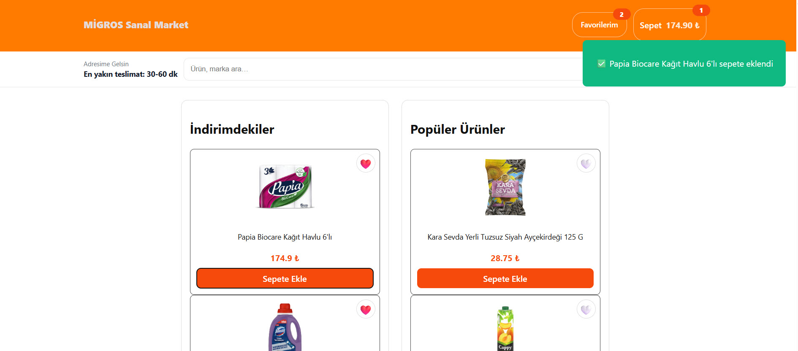
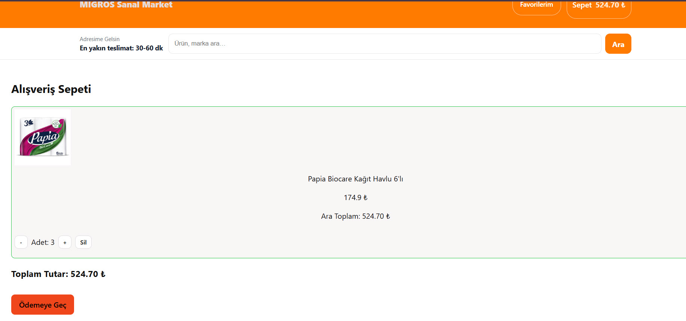
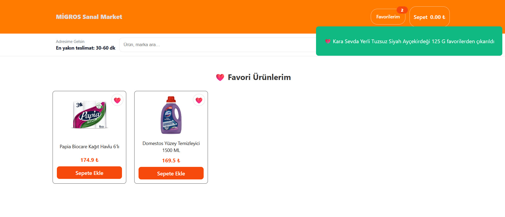
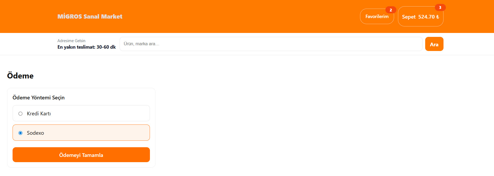

# Migros Shopping Cart (React + Redux Toolkit)

A modern e-commerce shopping cart application inspired by Migros, built with React, Redux Toolkit, and Vite.

## Live Demo
- Frontend: https://migros-shop.vercel.app
- Backend: Hosted on Render (REST API)

## Tech Stack
- React 19
- Redux Toolkit (state management)
- React Router v7
- Axios (API communication)
- Vite
- JSON Server (mock backend API)
- Vercel (frontend deployment)
- Render (backend deployment)

## Features
- Product listing from backend REST API
- Add / remove items from cart
- Quantity management
- Favorites system
- Toast notifications
- Checkout flow with cart guard (prevents empty cart checkout)
- Responsive UI
- Environment-based API configuration
- Clean service layer architecture


## Architecture & Deployment
The project is split into two parts:

- **Frontend**: React application built with Vite and deployed on **Vercel**
- **Backend**: Mock REST API built with **json-server**, deployed separately on **Render**

During local development, both frontend and backend can run together.  
In production, they are deployed separately because Vercel hosts static frontend builds, while json-server requires a running server process.

## Environment Configuration
The frontend reads the API base URL from an environment variable:

```js
const API_URL = import.meta.env.VITE_API_URL;

VITE_API_URL=https://migros-backend-1.onrender.com

The same variable is configured in Vercel → Project Settings → Environment Variables.

Local Development
Frontend
npm install
npm run dev

Backend (optional local mock)
npm run server

> Desktop & mobile views






Summary

Clear separation of frontend and backend

Production-ready deployment with Vercel and Render

Defensive React patterns to prevent runtime errors

Scalable Redux Toolkit state management
